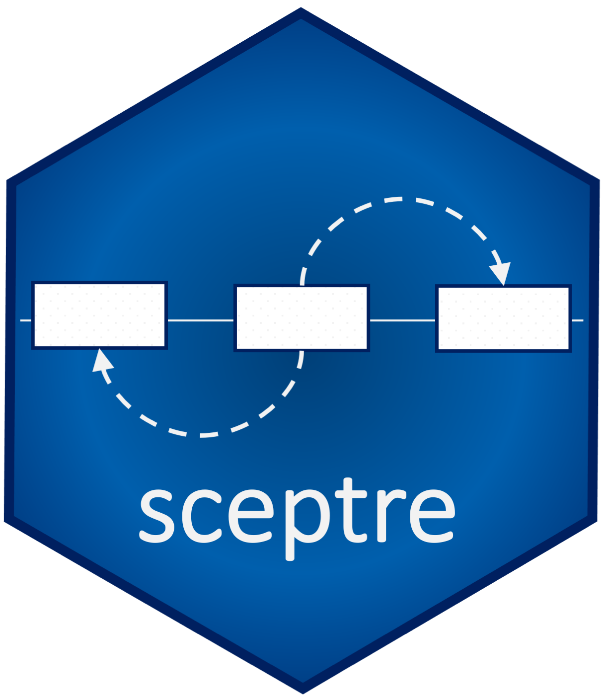

# SCEPTRE 

SCEPTRE (analysis of **s**ingle **c**ell **p**er**t**urbation screens via conditional **r**esampling) is a method for single-cell CRISPR screen analysis. SCEPTRE infers gene-enhancer associations by modeling the stochastic assortment of CRISPR guide RNAs among cells instead of modeling gene expression, thereby remaining valid despite arbitrary misspecification of the gene expression model.

Accompanying paper:
> *Conditional resampling improves sensitivity and specificity of single cell CRISPR regulatory screens* <br />
> E. Katsevich, T. Barry, and K. Roeder (2020)<br />
> preprint available at [bioRxiv](https://doi.org/10.1101/2020.08.13.250092)


## SCEPTRE package and manuscript code

This repository contains the **sceptre** R package and the code required to reproduce the analyses reported in Katsevich et al. 2020. Users can download and use the **sceptre** package independently of the manuscript analysis code.

### Downloading and installing **sceptre**

Run the following code within R.

```
library(devtools)
install_github(repo="Timothy-Barry/SCEPTRE", subdir="sceptre_package")
```

Access the [Package manual](https://github.com/Timothy-Barry/sceptre_paper/blob/master/sceptre_0.1.0.pdf) here. Detailed vignettes to come.

### Reproducing the Katsevich et al. 2020 analysis

Git clone the SCEPTRE repository:

```
git clone https://github.com/Timothy-Barry/SCEPTRE.git
```

Next, navigate to the *sceptre_paper/utilities* directory, open the *run_everything.bash* script, and follow the instructions therein. In short, update the file paths in *sceptre_paper/get_file_paths.bash*, download a small dataset manually, and execute *run_everything.bash* from within the *sceptre_paper/utilities* folder. Warning: this script likely would take several months to execute on a standard laptop. The code is commented to facilitate running specific parts of the analysis.