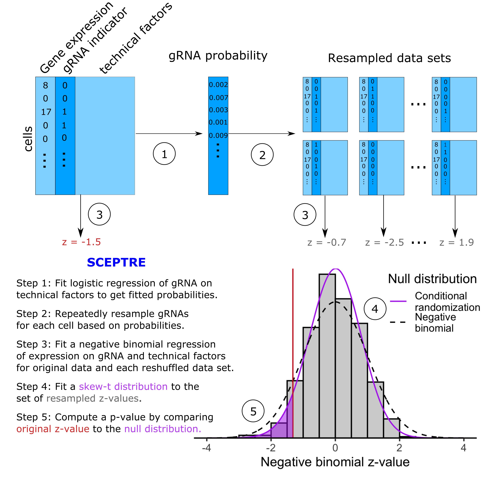

# SCEPTRE 

SCEPTRE (analysis of **s**ingle **c**ell **p**er**t**urbation screens via conditional **re**sampling) is a method for single-cell CRISPR screen analysis. SCEPTRE infers gene-enhancer associations by modeling the stochastic assortment of CRISPR guide RNAs among cells instead of modeling gene expression, thereby remaining valid despite arbitrary misspecification of the gene expression model.

Accompanying paper:
> *Conditional resampling improves sensitivity and specificity of single cell CRISPR regulatory screens* <br />
> E. Katsevich, T. Barry, and K. Roeder (2020)<br />
> preprint available at [bioRxiv](https://doi.org/10.1101/2020.08.13.250092)


## Using this repository

This repository contains the **sceptre** R package and the code required to reproduce the analyses reported in Katsevich et al. 2020. Users can download and use the **sceptre** package independently of the manuscript analysis code.

#### Downloading and installing **sceptre**

Run the following code within R.

```
library(devtools)
install_github(repo="Timothy-Barry/SCEPTRE", subdir="sceptre_package")
```

Access the [Package manual](https://github.com/Timothy-Barry/sceptre_paper/blob/master/sceptre_0.1.0.pdf) here. Detailed vignettes to come.

#### Reproducing the Katsevich et al. 2020 analysis

Git clone the SCEPTRE repository:

```
git clone https://github.com/Timothy-Barry/SCEPTRE.git
```

Next, navigate to the *sceptre_paper/utilities* directory, open the *run_everything.bash* script, and follow the instructions therein. The *run_everything.bash* script reproduces the entire analysis, from downloading the data and required packages to creating the figures. All analysis results (including intermediate files) are available on [Drive](https://drive.google.com/drive/u/0/folders/1ynZRMvGtFxfBiD0zAcuIYjNeS8Jj4AP9). Parts of the analysis can therefore be reproduced by loading the intermediate results files instead of recomputing them.

The code was executed on two machines running the Unix operating system: a cluster running R version 3.6.1, and a personal computer running R version 4.0.2.

## SCEPTRE methodology

SCEPTRE proceeds one guide RNA (gRNA) and one gene at a time. It uses the z-value from a negative binomial regression to measure the effect of the gRNA on the gene. Instead of calibrating this z-value against a standard normal null distribution, it builds a null distribution for this statistic via conditional resampling. To this end, it first fits a logistic regression model for the occurrence of the gRNA in a cell, based on its covariates. For each cell, this yields a fitted probability that it contains the gRNA. Then, it generates a large number (default 500) of reshuffled datasets, where the expression and the covariates stay the same, while the gRNA assignment is redrawn independently for each cell based on its fitted probability. The negative binomial z-value is then recomputed for each of these datasets, which comprise a null distribution. A skew-t distribution is fit to these null histograms and the SCEPTRE p-value is defined by comparing the original z-value to this fitted skew-t null distribution.

<p align="center">
  
</p>

## Code authors
- [Tim Barry](https://timothy-barry.github.io/)
- [Eugene Katsevich](https://ekatsevi.github.io/)
